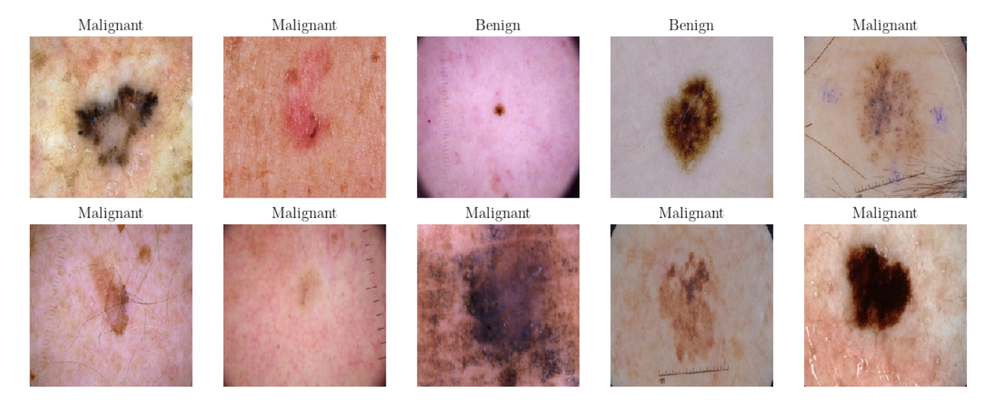

# CNN to Classify Skin Tumors



__Refer to the project [REPORT](Report.pdf) for a more detailed analysis of the networks used, testing and validation scores, model comparisons and results.__

This project aims to evaluate different Convolutional Neural Networks (CNNs hereafter) models to classify benign and malignant tumors in skin moles. The dataset utilized involves 3600 images of skin moles afflicted by tumors. A self-made CNN model was built and compared to two industry-leading CNNs: ResNet50 and VGG19. For each model, the metrics of interest in comparison were training / validation accuracies, confusion matrix counts and test data prediction accuracy scores.

## Built With

- Tensorflow - model architecture, training and validation 
- Sklearn - model metrics, confusion matrix scores
- Keras - convolutional, max-pooling and dense layer structures

## Training & Validation Dataset

This dataset was sourced from a Kaggle contribution by Claudio Fancioni: [Link to Kaggle Dataset](https://www.kaggle.com/datasets/fanconic/skin-cancer-malignant-vs-benign?resource=download)

To operate the project, please download the folder and save it into a directory with the following path:
```
Root/project/folder/archive
```

## Usage

All Python package requirements are outlined in [```requirements.txt```](requirements.txt). Once installed, the project can be run through the notebook ['''Classifier.ipynb'''](Classifier.ipynb).
    
